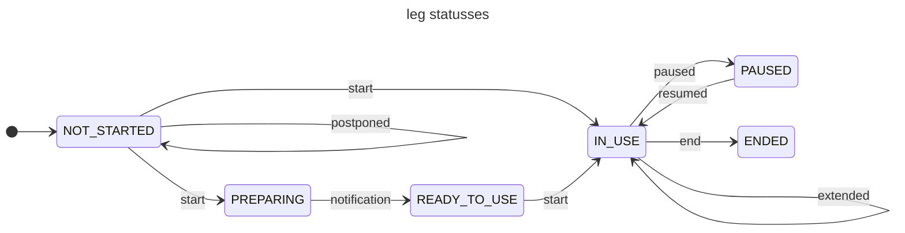

### Leg statusses 

| state | end-state | rel | href | remarks | |
|---|----|-----|------|-------|-----|
| NOT_STARTED | IN_USE | start-leg | POST /processes/start-leg/execution | |
| IN_USE | PAUSED | pause-leg | POST /processes/pause-leg/execution | | 
| NOT_STARTED | PREPARING | start-leg | POST /processes/start-leg/execution | |
| PREPARING | READY_TO_USE | | Send by MP notification |
| READY_TO_USE | start-leg | IN_USE | POST /processes/start-leg/execution | |
| PAUSED | IN_USE | resume-leg | POST /processes/resume-leg/execution | |
| IN_USE | ENDED | end-leg | POST /processes/end-leg/execution | | 
| PAUSED | ENDED | end-leg | POST /processes/end-leg/execution | | 
| IN_USE | IN_USE | extend-leg | POST /processes/extend-leg/execution | | 
| NOT_STARTED | NOT_STARTED | postpone-leg | POST /processes/postpone-leg/execution | | 

