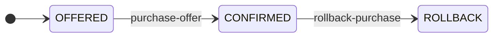
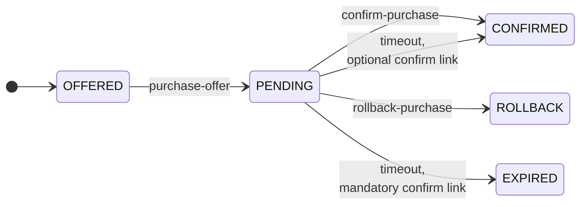
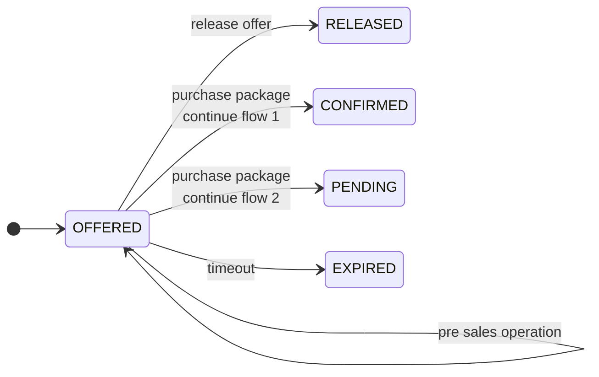
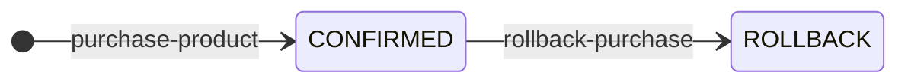
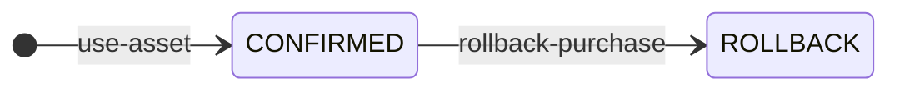

## Flow option 1: With offers, without pre-sales, without 2-phase purchase



| state | rel | end-state | href | remarks | | 
|---|----|-----|------|-------|-----|
| OFFERED | purchase-offer | CONFIRMED | POST /processes/purchase-offers/execution | when working with offers that can be bought directly | | 
| CONFIRMED | rollback-purchase | ROLLBACK | POST /processes/rollback-purchase/execution | direct purchase, but with a time window to rollback the purchase || 

Example link collection to purchase an offer, containing an example link in status 'OFFERED'
```json
[ 
    { "rel": "purchase-offer", 
      "href": "https://bike.org/tomp/v2/processes/purchase-offers/execution", 
      "body": { "inputs": { "offer": "2581dd23-460d-4df0-b8cf-fb2c97e17a40" } },
      "method": "POST",
      "type": "application/geo+json"
    }
]
```
Of course, in the link collection could contain of course a link to show the details, referring to the /collections/offers/items.

Example link collection to rollback a purchase, containing an example link in status 'CONFIRMED'
```json
[ 
    { "rel": "rollback-purchase", 
      "href": "https://bike.org/tomp/v2/processes/rollback-purchase/execution", 
      "body": { "inputs": { "package": "2581dd23-460d-4df0-b8cf-fb2c97e17a40" } },
      "method": "POST",
      "type": "application/geo+json"
    }
]
```

## Flow option 2: With offers, without pre-sales, 2-phase purchase



| state | rel | end-state | href | remarks | |
|---|----|-----|------|-------|-----|
| OFFERED | purchase-offer | PENDING | POST /processes/purchase-offers/execution | when working with offers that can be bought |
| PENDING | confirm-purchase | CONFIRMED | POST /processes/confirm-purchase/execution | to confirm |
| PENDING | rollback-purchase | ROLLBACK  | POST /processes/rollback-purchase/execution | to undo the purchase before the expiry time is reached |
| PENDING | | EXPIRED | | timeout, not confirmed. Only when there is a mandatory confirm-link | 
| PENDING | | CONFIRMED | | automatically, when there is no confirm-link or an optional one.  There should be send a notification (MP Module) | 

## Flow option 3: Pre-sales applies (combined with option 1 or 2)



__Note__ The 'purchase-offers' endpoint should not anymore applicable when you apply the 'pre-sales' module.

| state | rel | end-state | href | remarks | | 
|---|----|-----|------|-------|-----|
| OFFERED | select-offers | OFFERED | POST /processes/select-offers/execution | to bundle offers into a package, claims resources | 
| | update-traveller | OFFERED | POST /processes/update-traveller/execution | | | 
| | update-travel-specification | OFFERED | POST /processes/update-travel-specification/execution | start & end location & time | | 
| | assign-asset | OFFERED | POST /processes/assign-asset/execution | bikes, seats | | 
| | assign-ancillary | OFFERED | POST /processes/assign-ancillary/execution | | | 
| | remove-offer | OFFERED | POST /processes/remove-offer/execution | | | 
| OFFERED | release-package | RELEASED | POST /processes/release-package/execution | to release the claimed resources of the package | | 
| OFFERED | purchase-package | CONFIRMED | POST /processes/purchase-package/execution | when working with packages, containing offers | | 
| OFFERED | purchase-package | PENDING | POST /processes/purchase-package/execution | when working with packages, containing offers, 2 phase purchase | |
| OFFERED | | EXPIRED | | timeout, not purchased before expiry time | 

## Flow option 4: direct purchase of a product


When the rollback window has expired (see the 'expiry' header field in the response), the link to rollback the purchase must not be published anymore.

## Flow option 4: direct use of an asset


When the rollback window has expired (see the 'expiry' header field in the response), the link to rollback the purchase must not be published anymore.