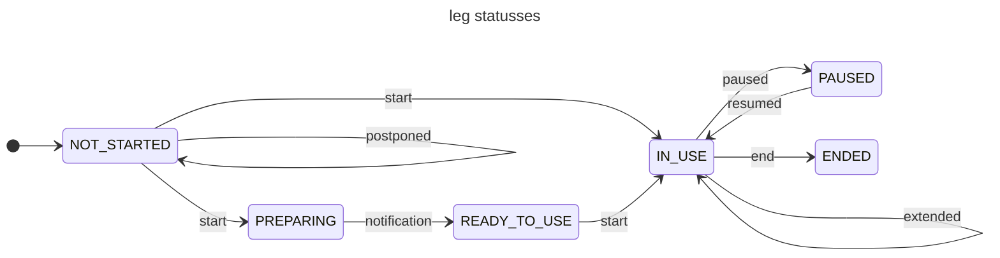

# leg

**Type:** `object`

semantics [{'transmodel': 'LEG'}]

---

## Composition (allOf)

This schema is composed of **all** of the following schemas:

1. [geojsonFeature](geojsonFeature.md)
   - Properties: `type`, `id`, `geometry`, `properties`, `links`
2. object
   - Properties: `id`, `properties`

### Leg statusses 

| state | end-state | rel | href | remarks | |
|---|----|-----|------|-------|-----|
| NOT_STARTED | IN_USE | start-leg | POST /processes/start-leg/execution | |
| IN_USE | PAUSED | pause-leg | POST /processes/pause-leg/execution | | 
| NOT_STARTED | PREPARING | start-leg | POST /processes/start-leg/execution | |
| PREPARING | READY_TO_USE | | Send by MP notification |
| READY_TO_USE | start-leg | IN_USE | POST /processes/start-leg/execution | |
| PAUSED | IN_USE | resume-leg | POST /processes/resume-leg/execution | |
| IN_USE | ENDED | end-leg | POST /processes/end-leg/execution | | 
| PAUSED | ENDED | end-leg | POST /processes/end-leg/execution | | 
| IN_USE | IN_USE | extend-leg | POST /processes/extend-leg/execution | | 
| NOT_STARTED | NOT_STARTED | postpone-leg | POST /processes/postpone-leg/execution | | 


## Example

```json
{
  "type": "Feature",
  "properties": {
    "id": "a2163410-261b-4932-acd5-0cc3f887affe",
    "type": "leg",
    "specification": {
      "type": "travelSpecification",
      "from": "P:LocationA", 
      // In the 'places' list of the featurecollection (offer list or package), there must be a place with id 'LocationA'
      "via": []
    },
    "sequenceNumber": 0,
    "mode": "BIKE",
    "status": "NOT_STARTED"
  },
  "id": "a2163410-261b-4932-acd5-0cc3f887affe",
  "geometry": { "type": "LineString", "coordinates": [...] },
  "links": [
    {
      "href": "https://example.com/tomp/v1/processes/start-leg/execution",
      "rel": "start-leg",
      "type": "application/geo+json",
      "method": "POST",
      "description": "start the leg"
    }
  ]
}
```