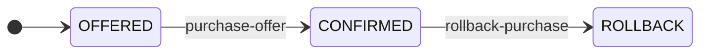
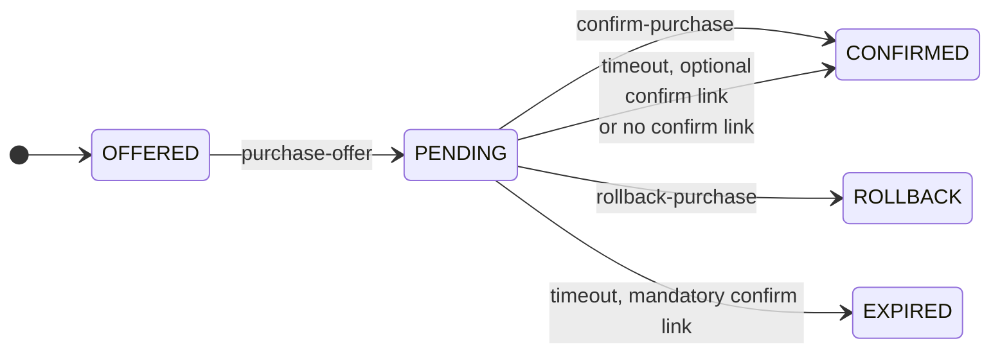
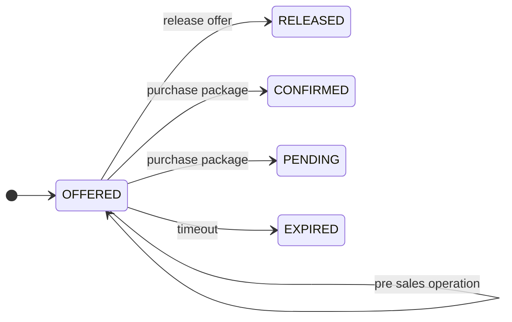

# package

**Type:** `object`

---

## Composition (allOf)

This schema is composed of **all** of the following schemas:

1. [geojson](geojson.md)
   - Properties: `type`, `features`, `properties`, `numberMatched`, `numberReturned`, `links`
2. object
   - a package to execute a trip
   - Properties: `properties`

## Allowed status changes (incl links)

At the bottom of each offer, package or leg, you'll find the 'links' collection.  
The content of the list depends on the status of the object. 

### Package/offer statusses, without pre-sales, without 2-phase purchase



| state | rel | end-state | href | remarks | | 
|---|----|-----|------|-------|-----|
| OFFERED | purchase-offer | CONFIRMED | POST /processes/purchase-offers/execution | when working with offers that can be bought directly | | 
| CONFIRMED | rollback-purchase | ROLLBACK | POST /processes/rollback-purchase/execution | direct purchase, but with a time window to rollback the purchase || 

Example json (list of links), to purchase an offer
```json
[ 
    { "rel": "purchase-offer", 
      "href": "https://bike.org/tomp/v2/processes/purchase-offers/execution", 
      "body": { "inputs": { "offer": "2581dd23-460d-4df0-b8cf-fb2c97e17a40" } },
      "method": "POST",
      "type": "application/geo+json"
    }
]
```

### Package/offer statusses, without pre-sales, 2-phase purchase



| state | rel | end-state | href | remarks | |
|---|----|-----|------|-------|-----|
| OFFERED | purchase-offer | PENDING | POST /processes/purchase-offers/execution | when working with offers that can be bought |
| PENDING | confirm-purchase | CONFIRMED | POST /processes/confirm-purchase/execution | to confirm |
| PENDING | rollback-purchase | ROLLBACK  | POST /processes/rollback-purchase/execution | to undo the purchase before the expiry time is reached |
| PENDING | | EXPIRED | | timeout, not confirmed. Only when there is a mandatory confirm-link | 
| PENDING | | CONFIRMED | | automatically, when there is no confirm-link or an optional one.  There should be send a notification (MP Module) | 

### Package/offer statusses, pre-sales addition



__Note__ The 'purchase-offers' is not anymore applicable.

| state | rel | end-state | href | remarks | | 
|---|----|-----|------|-------|-----|
| OFFERED | select-offers | OFFERED | POST /processes/select-offers/execution | to bundle offers into a package, claims resources | 
| | update-traveller | OFFERED | POST /processes/update-traveller/execution | | | 
| | update-travel-specification | OFFERED | POST /processes/update-travel-specification/execution | start & end location & time | | 
| | assign-asset | OFFERED | POST /processes/assign-asset/execution | bikes, seats | | 
| | assign-ancillary | OFFERED | POST /processes/assign-ancillary/execution | | | 
| | remove-offer | OFFERED | POST /processes/remove-offer/execution | | | 
| OFFERED | release-package | RELEASED | POST /processes/release-package/execution | to release the claimed resources of the package | | 
| OFFERED | purchase-package | CONFIRMED | POST /processes/purchase-package/execution | when working with packages, containing offers | | 
| OFFERED | purchase-package | PENDING | POST /processes/purchase-package/execution | when working with packages, containing offers, 2 phase purchase | |
| OFFERED | | EXPIRED | | timeout, not purchased before expiry time | 

### Package statusses while executing

| state | rel | end-state | href | remarks | | 
|---|----|-----|------|-------|-----|
| CONFIRMED | update-traveller | CONFIRMED | POST /processes/update-traveller/execution | | | 
| | update-travel-specification | CONFIRMED | POST /processes/update-travel-specification/execution | start & end location & time | | 
| | assign-asset | CONFIRMED | POST /processes/assign-asset/execution | bikes, seats | | 
| | assign-ancillary | CONFIRMED | POST /processes/assign-ancillary/execution | | | 
| CONFIRMED | | STARTED | | when first leg is started |

## Additional links

### Products

There are 2 'product' links: 
* initiate, is a link that can be found on package level. When calling this operation, a new leg is made, in the status 'STARTED' and attached to the package.
* activate. Sometimes it is required to activate a product before it can be used. This link can also be found on the package level, and the package must also contain the product.

```json
[ 
    { "rel": "activate-product", 
      "href": "https://bike.org/tomp/v2/processes/activate-product/execution", 
      "body": { "inputs": { "package": "2581dd23-460d-4df0-b8cf-fb2c97e17a40", "product": "WEEKLY CARD" } },
      "method": "POST",
      "type": "application/geo+json"
    }
]
```
## Example

```json
{
  "type": "FeatureCollection",
  "features": [
    {
      "type": "Feature",
      "properties": {
        "type": "Leg",
        "id": "5d260584-9f78-4204-884b-3dd899a68f57"
      },
      "id": "5d260584-9f78-4204-884b-3dd899a68f57",
      "geometry": {
        "type": "LineString",
        "geometry": [
          [
            [
              6.169639,
              52.253279
            ],
            [
              6.05623,
              52.63473
            ]
          ]
        ]
      },
      "links": []
    }
  ],
  "properties": {
    "type": "offer",
    "id": "aff11b01-c888-44ff-b6f5-d0aed162f605",
    "status": "OFFERED",
    "summary": {
      "id": "aff11b01-c888-44ff-b6f5-d0aed162f605",
      "specification": {
        "type": "travelSpecification",
        "from": "GPS:52.342392,41.43i4234"
      },
      "price": {
        "amount": 5.54,
        "currencyCode": "EUR"
      }
    },
    "price": {
      "amount": 5.54,
      "taxPercentageUsed": 21,
      "currencyCode": "EUR",
      "elements": [
        {
          "amount": 3.14,
          "type": "FIXED"
        },
        {
          "amount": 2.40,
          "type": "FLEX",
          "priceCondition": "DEFAULT",
          "units": "HRS",
          "amountOfUnits": 1
        }
      ],
      "estimated": true,
      "description": "Estimated price for one hour of usage"
    }
  }
}
```